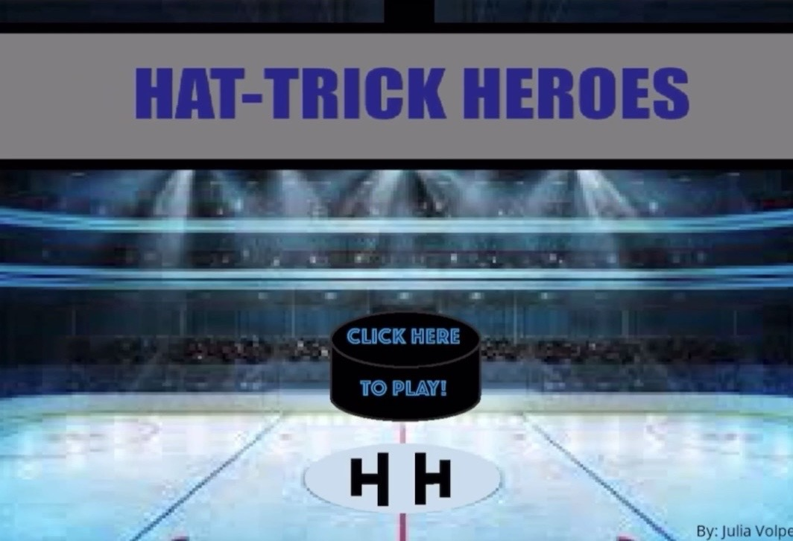
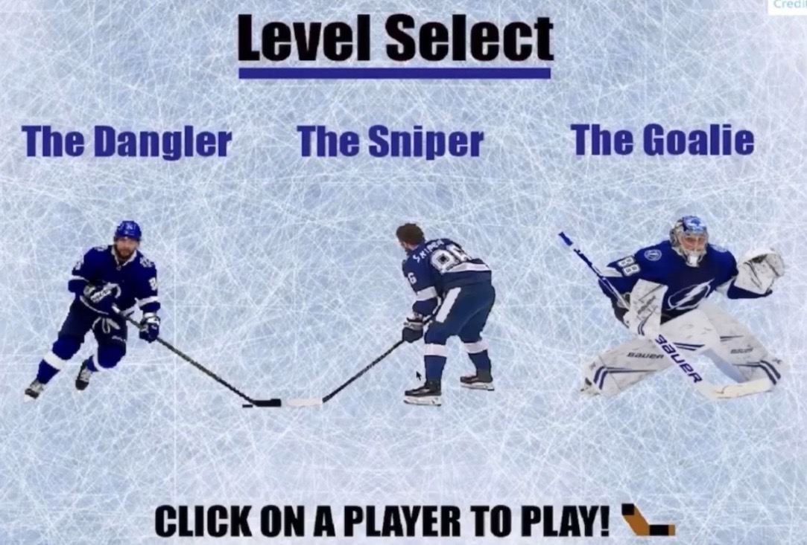
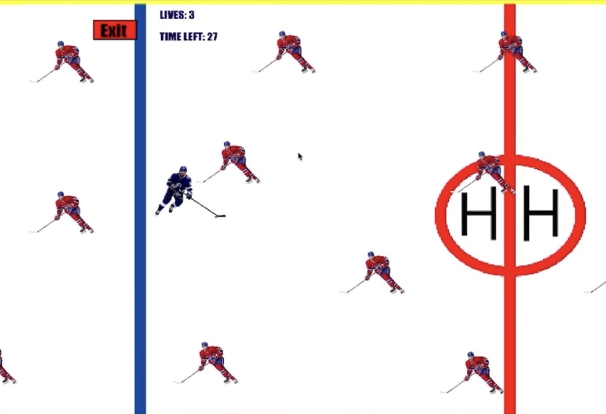
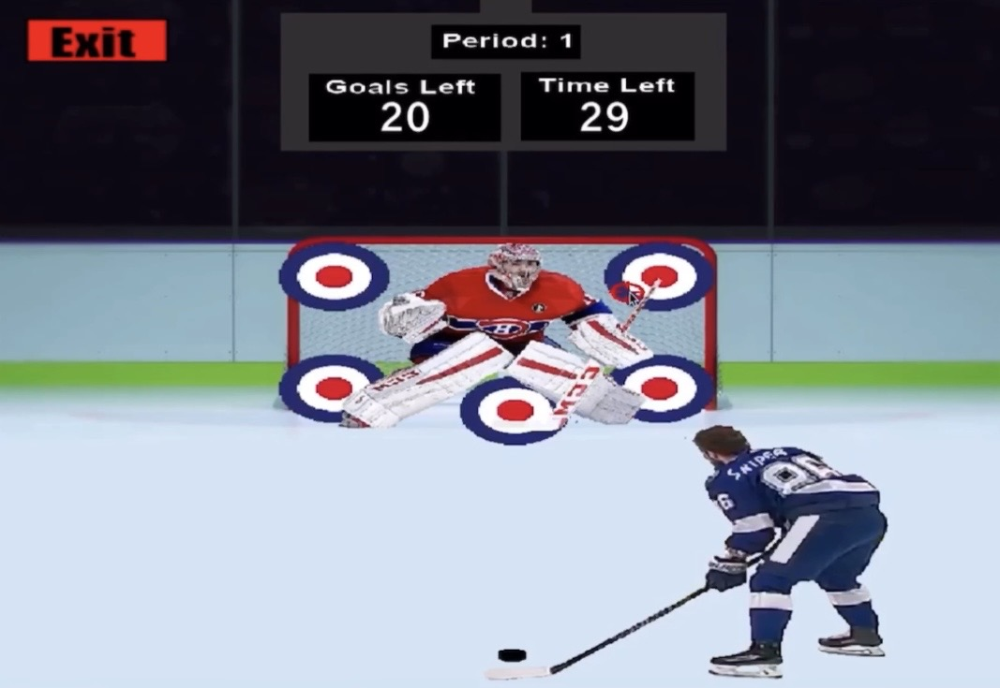
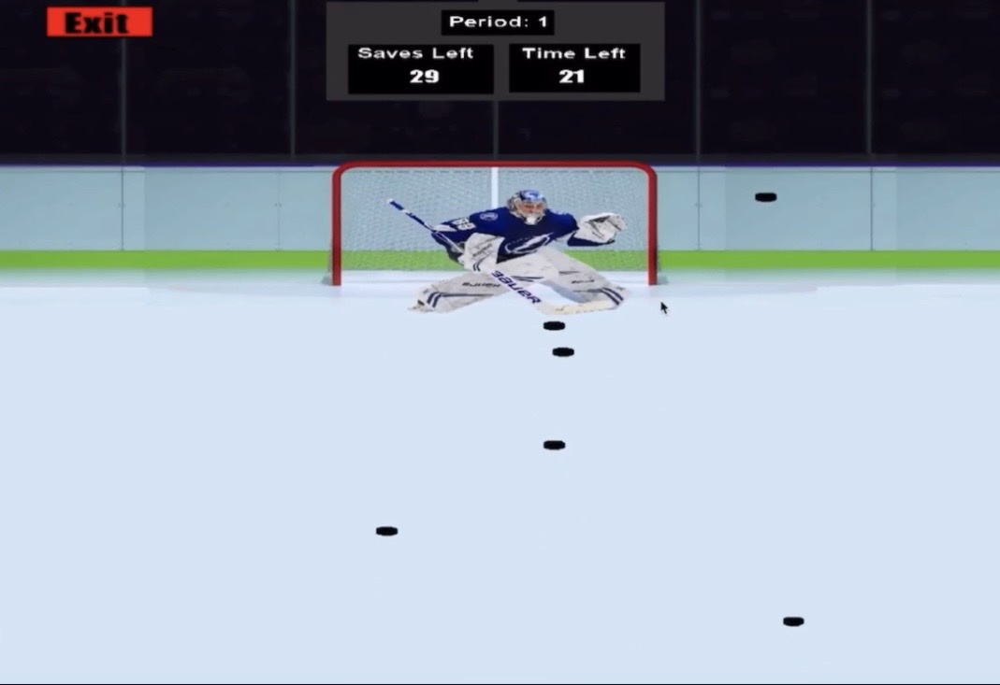

# Hat-Trick Heroes

Hat-Trick Heroes is a 2D arcade-style hockey game I created in college using GameMaker. The game features three playable challenge modes — The Dangler, The Sniper, and The Goalie — each focused on a different hockey skill.

While the original project files are no longer available, this repository preserves screenshots, gameplay footage, and documentation for the project.

Note: This was a student project created for educational purposes as part of my early game development experience.

Gameplay Modes

## The Dangler

Navigate through moving defenders using WASD or the arrow keys. The player starts at one end of the ice and must reach the finish line before time runs out while avoiding opposing players. The player has three lives and multiple difficulty levels.

## The Sniper

A shooting challenge where the player clicks on targets to aim shots. Targets appear and disappear more quickly on higher difficulties, and on harder levels they also move around the goal.

## The Goalie

Control the goalie using WASD and move left or right to stop incoming pucks. Pucks come from different angles and locations, and the player must make a set number of saves before time expires.

## Features

* Three unique hockey-themed game modes
* Keyboard and mouse-based controls
* Multiple difficulty levels
* Timed gameplay challenges
* Lives, save, and scoring objectives
* Custom menus and level selection screens
* Distinct gameplay mechanics for each mode

## Screenshots

### Main Menu

### Level Select

### The Dangler

### The Sniper

### The Goalie

## Gameplay Video

Watch the full gameplay demo:

[🎮 Gameplay Demo](media/hthgameplay.MOV)

Built With

* GameMaker
* GameMaker Drag-and-Drop Visual Scripting
* Custom gameplay logic and level design
* Event-driven game mechanics
* 2D sprite-based gameplay

What I Learned

Hat-Trick Heroes was one of my earliest game development projects and gave me hands-on experience designing a complete playable game from concept to completion. Through building multiple game modes, I learned how to structure gameplay systems, create difficulty progression, design user interfaces and menus, implement timers and objectives, and think critically about player experience and game balance.

The project also reinforced my passion for combining software development with gaming and interactive experiences.

Project Status

The original GameMaker project files are no longer available. This repository serves as an archive of the project through gameplay footage, screenshots, and documentation.